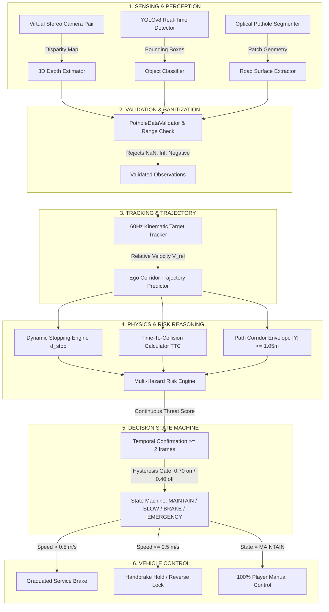

# 🛡️ SAFAR: Complete System Architecture, Pipeline & Variable Reference

**SAFAR (Safety Assisting Forward-looking AI Reflex)** is a modular, physics-aware vehicular safety and collision mitigation engine. It acts as an autonomous safety reflex that continuously observes, predicts, and evaluates physical stopping limits while leaving 100% manual control to the driver under safe conditions.

---

## 📑 Table of Contents
1. [End-to-End Pipeline Architecture](#1-end-to-end-pipeline-architecture)
2. [File-by-File Technical Breakdown](#2-file-by-file-technical-breakdown)
   - [A. Python Pothole Intelligence (`safar/pothole/`)](#a-python-pothole-intelligence-safarpothole)
   - [B. Python Perception & Vision (`safar/perception/` & `tools/`)](#b-python-perception--vision-safarperception--tools)
   - [C. Unreal Engine 5 C++ Core (`Source/TrafficGame/SAFAR/`)](#c-unreal-engine-5-c-core-sourcetrafficgamesafar)
3. [Exhaustive Variable & Parameter Dictionary](#3-exhaustive-variable--parameter-dictionary)
4. [State Machine & Hysteresis Logic](#4-state-machine--hysteresis-logic)
5. [Mathematical Formulas & Kinematics](#5-mathematical-formulas--kinematics)

---

## 1. End-to-End Pipeline Architecture

---

## 2. File-by-File Technical Breakdown

### A. Python Pothole Intelligence (`safar/pothole/`)

#### 1. [`config.py`](file:///C:/Users/shrey/OneDrive/Desktop/Projects/SAFAR/safar/pothole/config.py)
* **Purpose**: Central repository for all physical constants, stopping parameters, safety limits, and classification maps.
* **Key Variables**:
  * `REACTION_TIME_S` ($0.18\text{ s}$): Perception, calculation, and CAN-bus brake system latency.
  * `DECEL_NOMINAL_MPS2` ($6.0\text{ m/s}^2$): Comfortable graduated service braking deceleration.
  * `DECEL_EMERGENCY_MPS2` ($8.5\text{ m/s}^2$): Maximum anti-lock dry asphalt emergency braking deceleration.
  * `CONFIDENCE_THRESHOLD` ($0.70$): Minimum ML probability required to treat an anomaly as valid.
  * `ACTIVATION_THRESHOLD` ($0.70$): Threat risk score required to activate automatic braking.
  * `RELEASE_THRESHOLD` ($0.40$): Lower risk threshold required before releasing active brakes (hysteresis).
  * `MIN_HOLD_DURATION_S` ($0.35\text{ s}$): Minimum duration to hold active intervention to prevent high-frequency toggling.
  * `LANE_HALF_WIDTH_M` ($1.75\text{ m}$): Standard lane half-width.
  * `VEHICLE_HALF_WIDTH_M` ($1.05\text{ m}$): Half-width of vehicle track plus safety buffer.
  * `SAFE_SPEED_MAPPINGS`: Target approach speeds ($30\text{ m/s}$ for drivable path, $12\text{ m/s}$ for small potholes, $6\text{ m/s}$ for medium potholes, $2\text{ m/s}$ for craters).

#### 2. [`validation.py`](file:///C:/Users/shrey/OneDrive/Desktop/Projects/SAFAR/safar/pothole/validation.py)
* **Purpose**: Robust data sanitization layer ensuring physical sanity of measurements.
* **Classes**: `PotholeDataValidator`
* **Key Methods**:
  * `validate_measurement(width, length, depth)`: Checks that values are non-null, finite numbers, positive, and within physical automotive limits ($W \le 10\text{m}, L \le 20\text{m}, D \le 1.0\text{m}$).
  * `validate_dataset(df)`: Validates dataset integrity prior to model training.

#### 3. [`model.py`](file:///C:/Users/shrey/OneDrive/Desktop/Projects/SAFAR/safar/pothole/model.py)
* **Purpose**: Trains, benchmarks, and serializes machine learning models using `joblib`.
* **Classes**: `PotholeModelTrainer`
* **Key Methods**:
  * `benchmark_models(df)`: Evaluates Decision Tree, Random Forest, Extra Trees, and Gradient Boosting with stratified 5-fold cross-validation.
  * `train_and_save(df, model_type, save_path)`: Trains the production Gradient Boosting classifier and exports `pothole_model.joblib`.
  * `load_model(model_path)`: Loads serialized model bundle containing model instance, class names, and feature signatures.

#### 4. [`classifier.py`](file:///C:/Users/shrey/OneDrive/Desktop/Projects/SAFAR/safar/pothole/classifier.py)
* **Purpose**: Decoupled ML inference layer. Strictly answers: *"What type of road anomaly is this?"*
* **Classes**: `PotholeObservation`, `PotholeClassifier`
* **Key Fields in `PotholeObservation`**:
  * `pothole_id` (`int`): Unique tracking ID.
  * `pothole_type` (`int`): $0=$ `drivable_path`, $1=$ `Sml_ph`, $2=$ `Mid_ph`, $3=$ `Crater`, $-1=$ `UNCERTAIN`/`INVALID`.
  * `pothole_name` (`str`): Human-readable classification label.
  * `width` (`float`, meters): Estimated transverse dimension.
  * `length` (`float`, meters): Estimated longitudinal dimension.
  * `depth` (`float`, meters): Estimated depression depth.
  * `confidence` (`float` $[0.0, 1.0]$): Max softmax probability from `predict_proba`.
  * `distance_forward` (`float`, meters): Longitudinal distance ahead ($Z$).
  * `distance_lateral` (`float`, meters): Lateral offset from vehicle centerline ($X$).
  * `is_valid` (`bool`): `True` if measurement is physically sane and `confidence >= 0.70`.
  * `status` (`str`): `"CONFIDENT"`, `"UNCERTAIN"`, or `"INVALID_DATA"`.

#### 5. [`physics.py`](file:///C:/Users/shrey/OneDrive/Desktop/Projects/SAFAR/safar/pothole/physics.py)
* **Purpose**: Kinematic calculations for stopping distance, safety margins, and time-to-pothole.
* **Classes**: `PotholePhysicsEngine`
* **Key Methods & Variables**:
  * `calculate_stopping_distance(speed_mps, decel_mps2, reaction_time_s)`:
    $$d_{\text{stop}} = v \cdot t_{\text{react}} + \frac{v^2}{2a}$$
  * `calculate_safety_ratio(distance_m, speed_mps)`:
    $$R_{\text{safety}} = \frac{d}{d_{\text{stop}} + d_{\text{margin}}}$$
  * `calculate_time_to_pothole(distance_m, speed_mps)`:
    $$t = \frac{d}{v} \quad (\text{if } v \le 0.05 \implies \infty)$$

#### 6. [`path.py`](file:///C:/Users/shrey/OneDrive/Desktop/Projects/SAFAR/safar/pothole/path.py)
* **Purpose**: Evaluates spatial overlap between vehicle driving corridor and hazard footprint.
* **Classes**: `PathIntersectionStatus`, `PotholeCorridorEvaluation`, `PotholePathGeometry`
* **Corridor Statuses**:
  * `PATH_CLEAR`: Pothole is outside the vehicle driving envelope ($|X| > 1.05\text{m}$).
  * `POSSIBLE_INTERSECTION`: Pothole grazes the safety margin ($1.05\text{m} < |X| \le 1.75\text{m}$).
  * `INTERSECTION`: Pothole is directly in the path of the vehicle wheels ($|X| \le 1.05\text{m}$).

#### 7. [`risk.py`](file:///C:/Users/shrey/OneDrive/Desktop/Projects/SAFAR/safar/pothole/risk.py)
* **Purpose**: Synthesizes physical depth, approach speed, stopping limits, and lateral relevance into an explainable risk assessment.
* **Classes**: `PotholeSeverity`, `PotholeRiskAssessment`, `PotholeRiskEngine`
* **Key Fields in `PotholeRiskAssessment`**:
  * `risk_score` (`float` $[0.0, 1.0]$): Continuous physical danger score.
  * `severity` (`PotholeSeverity`): `SAFE`, `LOW`, `MEDIUM`, `HIGH`, `CRITICAL`.
  * `recommended_speed_mps` (`float`): Target safe speed for road conditions.
  * `recommended_action` (`str`): `"MAINTAIN_SPEED"`, `"MONITOR"`, `"SLOW_DOWN"`, `"BRAKE"`, `"EMERGENCY_BRAKE"`.

#### 8. [`decision.py`](file:///C:/Users/shrey/OneDrive/Desktop/Projects/SAFAR/safar/pothole/decision.py)
* **Purpose**: State machine that manages vehicle control arbitration with temporal filtering and hysteresis.
* **Classes**: `PotholeAction`, `PotholeDecision`, `PotholeDecisionEngine`
* **Key Fields in `PotholeDecision`**:
  * `state` (`PotholeAction`): `MAINTAIN`, `MONITOR`, `SLOW`, `BRAKE`, `EMERGENCY_BRAKE`.
  * `has_intervention` (`bool`): `True` if SAFAR actively applies brakes.
  * `hold_timer_active` (`bool`): `True` if minimum brake hold duration is active.
  * `reason` (`str`): Human-readable explanation of why action was taken.

#### 9. [`simulation.py`](file:///C:/Users/shrey/OneDrive/Desktop/Projects/SAFAR/safar/pothole/simulation.py)
* **Purpose**: End-to-end multi-hazard aggregator evaluating multiple concurrent potholes in a single scene.
* **Classes**: `PotholeSafetyPipeline`

#### 10. [`test_scenarios.py`](file:///C:/Users/shrey/OneDrive/Desktop/Projects/SAFAR/safar/pothole/test_scenarios.py)
* **Purpose**: Automated 12-scenario deterministic verification suite testing edge cases with 100% success rate.

#### 11. [`main.py`](file:///C:/Users/shrey/OneDrive/Desktop/Projects/SAFAR/safar/pothole/main.py)
* **Purpose**: Standalone CLI test harness for live interactive scenario evaluation.

---

### B. Python Perception & Vision (`safar/perception/` & `tools/`)

#### 1. [`safar/perception/yolo_detector.py`](file:///C:/Users/shrey/OneDrive/Desktop/Projects/SAFAR/safar/perception/yolo_detector.py)
* **Purpose**: Ultralytics YOLOv8 wrapper extracting real-time bounding boxes for road objects (`car`, `truck`, `bus`, `motorcycle`, `person`, `dog`).

#### 2. [`safar/perception/stereo_depth.py`](file:///C:/Users/shrey/OneDrive/Desktop/Projects/SAFAR/safar/perception/stereo_depth.py)
* **Purpose**: Computes mathematical stereo depth $Z = \frac{f \cdot B}{d_{\text{disp}}}$ from virtual left/right cameras.

#### 3. [`tools/test_safar_on_images.py`](file:///C:/Users/shrey/OneDrive/Desktop/Projects/SAFAR/tools/test_safar_on_images.py)
* **Purpose**: Comprehensive vision and hazard evaluation pipeline running YOLO + Optical Pothole Segmentation + Kinematics on real-world road images.

---

### C. Unreal Engine 5 C++ Core (`Source/TrafficGame/SAFAR/`)

#### 1. [`Core/SAFARTypes.h`](file:///C:/Users/shrey/OneDrive/Desktop/Projects/UETrafficGame_Sim/TrafficGame/Source/TrafficGame/SAFAR/Core/SAFARTypes.h)
* **Purpose**: Core data contracts and telemetry structures across C++ submodules (`FSafarDetection`, `FSafarTrackedObject`, `FSafarVehicleState`, `FSafarThreatAssessment`, `FSafarDecision`).

#### 2. [`Perception/GroundTruthPerceptionProvider.h`](file:///C:/Users/shrey/OneDrive/Desktop/Projects/UETrafficGame_Sim/TrafficGame/Source/TrafficGame/SAFAR/Perception/GroundTruthPerceptionProvider.h)
* **Purpose**: High-fidelity perception provider querying UE5 world actors within camera frustum ($78^\circ\text{ FOV}, 80\text{m range}$) with ego self-exclusion filters.

#### 3. [`Tracking/SAFARTargetTracker.h`](file:///C:/Users/shrey/OneDrive/Desktop/Projects/UETrafficGame_Sim/TrafficGame/Source/TrafficGame/SAFAR/Tracking/SAFARTargetTracker.h)
* **Purpose**: 60 Hz multi-target tracking computing relative velocity $\mathbf{V}_{\text{rel}} = \frac{\Delta \mathbf{P}}{\Delta t}$ and dead reckoning.

#### 4. [`Prediction/SAFARTrajectoryPredictor.h`](file:///C:/Users/shrey/OneDrive/Desktop/Projects/UETrafficGame_Sim/TrafficGame/Source/TrafficGame/SAFAR/Prediction/SAFARTrajectoryPredictor.h)
* **Purpose**: Projects vehicle and obstacle trajectories over future time horizons ($t \in [0.0, 3.5\text{s}]$).

#### 5. [`Threat/SAFARThreatEngine.h`](file:///C:/Users/shrey/OneDrive/Desktop/Projects/UETrafficGame_Sim/TrafficGame/Source/TrafficGame/SAFAR/Threat/SAFARThreatEngine.h)
* **Purpose**: Computes safety ratio $R = \frac{d}{d_{\text{stop}}}$ with 2-frame temporal confirmation.

#### 6. [`Decision/SAFARDecisionEngine.h`](file:///C:/Users/shrey/OneDrive/Desktop/Projects/UETrafficGame_Sim/TrafficGame/Source/TrafficGame/SAFAR/Decision/SAFARDecisionEngine.h)
* **Purpose**: State machine (`PASSIVE` $\to$ `ASSESSING` $\to$ `THREAT_CONFIRMED` $\to$ `INTERVENTION` $\to$ `THREAT_CLEARED`).

#### 7. [`Integration/SAFARVehicleComponent.h`](file:///C:/Users/shrey/OneDrive/Desktop/Projects/UETrafficGame_Sim/TrafficGame/Source/TrafficGame/SAFAR/Integration/SAFARVehicleComponent.h)
* **Purpose**: Master Unreal actor component with speed-gated service braking ($> 0.5\text{ m/s}$) and stationary handbrake lock ($\le 0.5\text{ m/s}$).

---

## 3. Exhaustive Variable & Parameter Dictionary

| Variable Name | Type / Units | Default Value | Defined In | Physical / Functional Description |
|---|---|---|---|---|
| `REACTION_TIME_S` | `float` (seconds) | `0.18` | `config.py` / `ThreatEngine` | Combined latency of sensor processing, trajectory calculation, and brake actuator pressurization. |
| `DECEL_NOMINAL_MPS2` | `float` ($\text{m/s}^2$) | `6.0` | `config.py` | Nominal service braking deceleration comfort limit on dry pavement. |
| `DECEL_EMERGENCY_MPS2`| `float` ($\text{m/s}^2$) | `8.5` | `config.py` | Maximum emergency braking deceleration utilizing full ABS capability. |
| `CONFIDENCE_THRESHOLD` | `float` (ratio) | `0.70` | `config.py` | Probability threshold below which ML predictions are marked `UNCERTAIN` and prevented from triggering interventions. |
| `ACTIVATION_THRESHOLD` | `float` (ratio) | `0.70` | `config.py` / `DecisionEngine` | Threat risk score required to activate automatic braking. |
| `RELEASE_THRESHOLD` | `float` (ratio) | `0.40` | `config.py` / `DecisionEngine` | Lower risk score boundary required before deactivating brakes (hysteresis). |
| `MIN_HOLD_DURATION_S` | `float` (seconds) | `0.35` | `config.py` / `DecisionEngine` | Anti-flapping hold timer that maintains brake pressure after hazard clearing. |
| `THREAT_CONFIRMATION_FRAMES` | `int` (frames) | `2` | `config.py` / `DecisionEngine` | Number of consecutive frames an obstacle must pose a threat before activating brakes. |
| `VEHICLE_HALF_WIDTH_M` | `float` (meters) | `1.05` | `config.py` / `path.py` | Physical half-width of vehicle track including side clearance buffer. |
| `LANE_HALF_WIDTH_M` | `float` (meters) | `1.75` | `config.py` / `path.py` | Standard driving lane half-width. |
| `CAMERA_FOCAL_LENGTH_PX`| `float` (pixels) | `720.0` | `test_safar_on_images.py` | Focal length used in pinhole camera distance estimation. |
| `CAMERA_MOUNT_HEIGHT_M`| `float` (meters) | `1.35` | `test_safar_on_images.py` | Height of windshield-mounted ADAS camera above the ground plane. |
| `STEREO_BASELINE_M` | `float` (meters) | `0.25` | `SAFARSensorRigComponent` | Lateral baseline distance between left and right virtual stereo camera lenses. |
| `MAX_PERCEPTION_RANGE_M`| `float` (meters) | `80.0` | `GroundTruthPerception` | Maximum longitudinal distance for sensor actor detection. |
| `REVERSE_PREVENTION_SPEED`| `float` ($\text{m/s}$) | `0.5` | `SAFARVehicleComponent` | Speed threshold below which service brake is replaced with handbrake to prevent transmission reverse shift. |

---

## 4. Mathematical Formulas & Kinematics

### 1. Dynamic Stopping Distance ($d_{\text{stop}}$)
$$d_{\text{stop}} = v \cdot t_{\text{react}} + \frac{v^2}{2a}$$

### 2. Time-To-Collision ($TTC$)
$$TTC = \frac{d_{\text{longitudinal}}}{V_{\text{closing}}} \quad (V_{\text{closing}} = v_{\text{ego}} - v_{\text{target\_longitudinal}})$$

### 3. Metric Stereo Depth ($Z$)
$$Z = \frac{f \cdot B}{d_{\text{disp}}}$$

### 4. Pinhole Monocular Distance Estimation
$$Z = \frac{f \cdot H_{\text{real}}}{h_{\text{bbox\_px}}}$$
$$X_{\text{lateral}} = \frac{(x_{\text{center\_px}} - c_x) \cdot Z}{f}$$

### 5. Multi-Factor Pothole Risk Score ($R_{\text{risk}}$)
$$R_{\text{risk}} = \text{BaseSeverity} \times (0.65 \cdot D_{\text{urgency}} + 0.35 \cdot S_{\text{excess}}) \times M_{\text{lateral}} \times C_{\text{confidence}}$$
